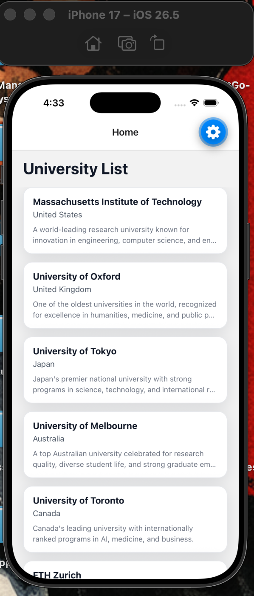
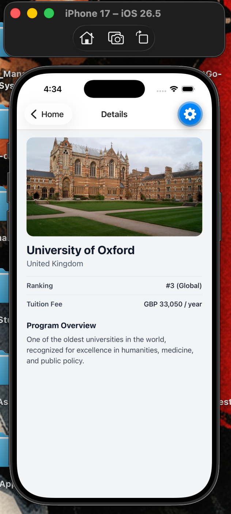

# Study Abroad App

A clean and modern React Native Expo application for browsing top universities around the world and viewing detailed program information.

## Project Overview

Study Abroad App helps users explore international universities in a simple, mobile-friendly interface. The app includes a curated list of institutions, quick previews on the home screen, and a dedicated details screen for deeper information such as ranking, tuition fee, and full description.

This project is built with Expo and React Navigation, making it easy to run across iOS, Android, and web from a single codebase.

## Features

- Browse a list of universities from multiple countries
- Reusable university card component
- Navigate from Home to Details with route params
- View complete university details:
  - Name
  - Country
  - Full description
  - Global ranking
  - Tuition fee
- Responsive spacing and layout for phones and tablets
- Clean and maintainable project structure

## Tech Stack

- React Native
- Expo (SDK 56)
- React 19
- React Navigation (Native Stack)
- JavaScript (ES modules)

Key packages:

- @react-navigation/native
- @react-navigation/native-stack
- react-native-gesture-handler
- react-native-safe-area-context
- react-native-screens
- react-native-reanimated

## Folder Structure

```text
.
├── App.js
├── app.json
├── index.js
├── package.json
├── assets/
└── src/
    ├── components/
    │   └── UniversityCard.js
    ├── constants/
    ├── data/
    │   └── universities.js
    ├── navigation/
    │   └── AppNavigator.js
    ├── screens/
    │   ├── HomeScreen.js
    │   └── DetailsScreen.js
    └── types/
```

## Installation Steps

### 1. Clone the repository

```bash
git clone <your-repository-url>
cd university-app
```

### 2. Install dependencies

```bash
npm install
```

## How To Run The Project

### Start Expo development server

```bash
npm start
```

### Run on specific platforms

```bash
npm run android
npm run ios
npm run web
```

### Notes

- For iOS on macOS, install Xcode and use iOS Simulator.
- For Android, use Android Studio emulator or a physical Android device with Expo Go.
- Ensure Node.js and npm are installed before running commands.

## Screenshots

Add your app screenshots in this section.

### Home Screen



### Details Screen



If you have not added screenshots yet, create this folder first:

```bash
mkdir -p assets/screenshots
```

Then save images as:

- assets/screenshots/home-screen.png
- assets/screenshots/details-screen.png

## Future Improvements

- Add search and filter by country
- Add favorites/bookmark functionality
- Integrate live university API data
- Add dark mode and theme customization

## License

This project is available under the license in [LICENSE](LICENSE).
